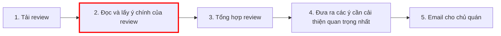
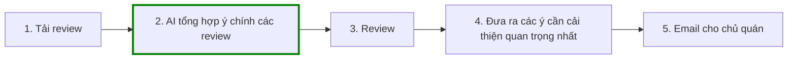

# Phase 1
Case ví dụ: 

John, nhân viên làm việc trong quán ăn ABC khoảng 12 người. Mỗi tuần John phải tổng hộp lại những đánh giá của khách hàng để báo cáo cho chủ quán . Mỗi ngày viết báo cáo thu nhập, chi phí gửi cho chủ quán


| # | Lăng kính | Problem quan sát được | Ai đang đau? | Dấu hiệu thật |
|---|---|---|---|---|
| 1 | Lập lại | Mỗi ngày phải viết báo cáo thu nhập | NV,CQ | lập lại mỗi ngày
| 2 | Tốn thời gian | Thống kê lại đánh giá của khách hàng | NV |  mất 120 phút/tuần
| 3 | AI có thể tốt hơn | Review từng comment của khách hàng | NV | 2-3p mỗi comment 
| 4 | Pain người khác | Chủ quán hỏi feedback của khách hàng nhưng chưa tổng hợp xong | CQ, NV | Trể deadline
| 5 | Tốn thời gian | Tốn thời gian nhập báo cáo, thiết kế report thay vì tối ưu vận hành quán | NV | Thời gian làm báo cáo kéo qua cuối ngày làm việc
| 6 | Pain người khác | Khách hàng phản hồi tiêu cực nhưng không được giải quyết do tổng hợp feedback cuối tuần | Khách hàng | Khách hàng bức xúc không quay lại, quán mất khách trung thành do phản hồi chậm

# Phase 2

| Rank | Problem | Vì sao chọn | Điều còn chưa chắc |
|---|---|---|---|
| 1 | Weekly review report | Nhiều người đau, ảnh hưởng mạnh đến doanh nghiệp | Nhân viên giấu review bảo vệ bản thân 
| 2 | Cost report | Tối ưu hóa việc viết báo cáo thu nhập | Độ chính xát của báo cáo
| 3 | Food waste | Tối ưu việc chi mua đồ ăn để tránh bỏ phí tiền | Xu khướng khách hàng ăn gì volatile 


# Card #1 - Weekly review report 

**Problem 1:**
Cuối tuần, John phải mất khoảng 120 phút tổng hợp review từ nhiều ứng dụng ăn khác nhau, tổng hợp lại review thành 1 danh sách đánh giá và gửi cho chủ quán.

**Actor:** 
John phải chịu trách nhiệm thống kê và gửi report

**Thời điểm:** 
Cuối tuần, sau giờ làm việc

**Work flow:**


```
1. Tải review của khách hàng từ nhiều ứng dụng ăn uống khác nhau.
2. Đọc và thu gọn/lấy ý chính của review
3. Viết và tổng hợp các review lại4. Từ các review đã tổng hợp, đưa ra những ý cần cải thiện quan trộng nhất
4. Email cho chủ quán
```

**Bottleneck:**  
Bước 2 — Đọc và gom lại ý chính từng review.

**Impact:**  
180 phút/tuần do các review bị dồn lại cuối tuần để làm. Khách hàng đầu tuần nhận phản hồi từ quán chậm.

**Success metric:**  
Giảm thời gian làm việc xuống 25 phút, chuyển qua làm hằng ngày khách hàng nhận phản hồi nhanh.

**Non-AI alternative:**  
không có

**AI hypothesis:**  
AI hỗ trợ tóm gọn/thu ý chỉnh review.

**Quick gut:**  
Workflow.

### Draft current workflow



### Draft future workflow



## Problem Cards #2 và #3 — tóm tắt

| Card | Actor | Bottleneck | Metric | Quick gut | Vì sao chưa chọn làm #1 |
|---|---|---|---|---|---|
| Cost report  | NV | Tính toán thu nhập của các món ăn | 20 phút → 5 phút | Workflow | Metric không đáng để thực hiện |
| Food waste | NV | Thống kê và dự đoán cho việc chi tiền mua nguyên liệu | 20 phút → dưới 2 phút | Workflow | Data lớn, scope to |
